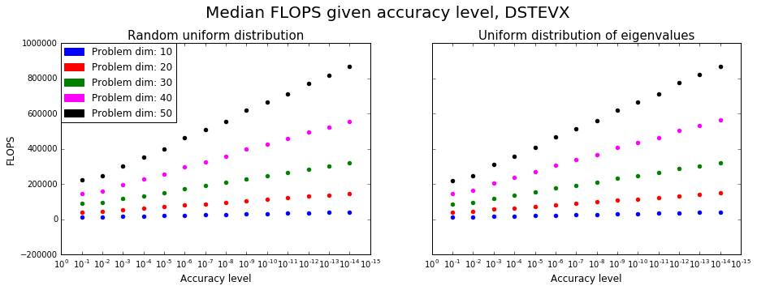
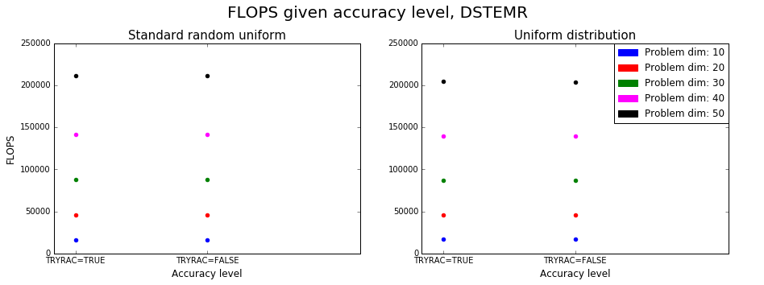
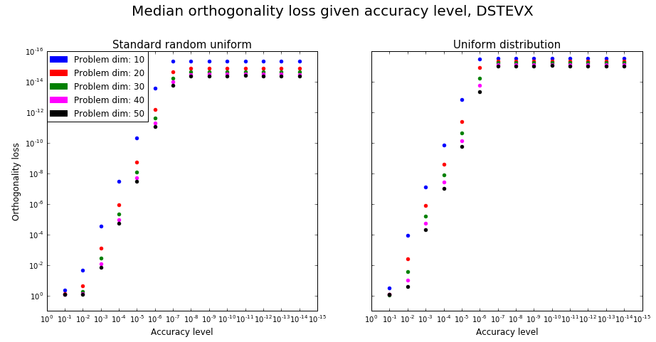
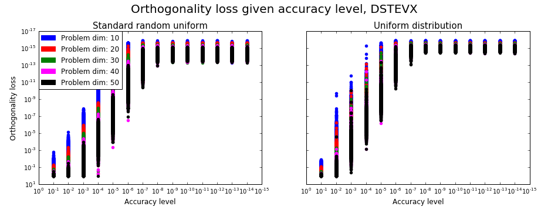
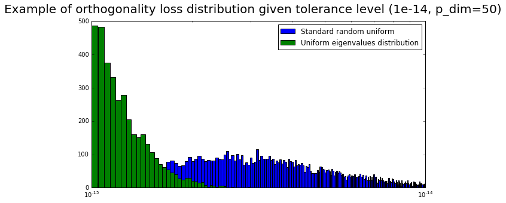

# Measuring performance of eigensolvers for small tridiagonal symmetric eigenproblems.

## Project description

* You are given thousands of small tridiagonal eigenproblems (n<60)           
* Compare the accuracy and speed of three eigensolvers: BX+II (DSTEVX), QR (DSTEQR), MR3 (DSTEMR).
* Compare different matrix types:
   * Random eigenvalues, uniform distribution (0, 1)                            
   * Uniform eigenvalue distribution (page 119 of [paper](http://arxiv.org/pdf/1401.4950v1.pdf))
* Instrument the code to count flops. (use [PAPI](http://icl.cs.utk.edu/papi/))
* Study flops vs accuracy, for different accuracy levels.

## Short description of eigensolvers we test

### QR

The general idea is to iteratively apply QR factorization to the matrix, then apply QR factorization for RxQ (R,Q are obtained from the previous iteration). In practice, an implicit approach is used as described in 7.5 paragraph of [3]. According to [2] the number of operations we need is *3bn^3+O(n^2)* where b is the average number of bulge chases and bulge chase procedure cannot use high level BLAS operations.

### DSTEVX (BX+II)
Uses bisection method to find eigenvalues, based on [Sturm's theorem](https://en.wikipedia.org/wiki/Sturm%27s_theorem) It has *O(nk)* complexity, where k is the number of eigenvalues. If eigenvelues are clustered, it uses Gram-Schmidt orthogonalization --> it is dependent on eigenvalues distribuiton.  Again, no high-level BLAS here.[2]

### MRRR
MRRR (MR3) algorithm is a modification of inverse iteration without Gram-Schmidt orthogonalization --> we can get *O(n^2)* Again, no high-level BLAS routines and the overall complexity depends of the eigenvalues distribution. [2]. 

## Data generation.

The data was generated in [Jupyter notebook](https://github.com/yobibyte/hpmc-eigensolvers/blob/master/hmpc-data-generation.ipynb). Initially the eigenvalues of needed dimension were generated (either sampled from standard random uniform distribution, or taken uniformly from [0,1]:

```python
if type == 'standard-random-uniform':
  eigenvalues = [np.random.uniform(size=problem_size) for i in range(n_examples)]
elif type == 'uniform-eigenvalues-dist':
  eigenvalues = [[eps+(k-1)*(1-eps)/(problem_size-1) for k in range(1,problem_size+1)] for i in range(n_examples)]
```

Different distributions were taken, I suppose, to check the dependency of BX+II and MRRR on the eigenvalues clustering. Then, I got random orthogonal matrices Q of the same dimensions and got the problems by Q*M*Q' (for orthogonal matrices the inverse is equivalent to transposed). The equality of initial eigenvalues and solutions to given problems was checked using numpy.testing library.

The generated data was then written to .csv files and read inside C program. The data (along with the resulting plots) can be downloaded from [here](https://www.dropbox.com/s/4oqqk8v7av1ntpg/hpmc_data.zip?dl=0).

## Code

Each experiment represent a separate run of a program that tests particular data file (10000 problems per file) with different problem dimension (10, 20, 30, 40 and 50), eigenvalue distribution (random uniform and uniform eigenvalue distributions) and algorithm (BX+II, MRRR, QR) to test. Inside each experiment there is a for loop with one iteration per problem. Before start of each iteration the garbage of L3 cache size was created to eliminate cache out of the experiments. PAPI library was used to check the real time of algorithm execution and the number of floating point operation per algorithm call. LAPACKE interface inside OpenBLAS was used, code was compiled with gcc.

## Results

All the plotting was done using matplotlib in [this](https://github.com/yobibyte/hpmc-eigensolvers/blob/master/results_analysis.ipynb) notebook.

### Accuracy and speed comparison

**Important**: since DSTEVX has relative tolerance parameter, it influences the execution time and the final accuracy, I used 1e-16 RTOL parameter for these experiments.

From the following plots we can see that MRRR is the fastest for both eigenvalues distributions(and the gap widens with the problem size). At the same time, it is the least accurate, given the fact in the **Important** section. Given the similar accuracy, we can say, that BX+II is slower, but it can be faster if we need less accuracy level.


At the same time, DSTEQR does more FLOPS than DSTEVX, but it is faster on problems of our size. DSTEMR also does the least number of FLOPS in the experiments


### Accuracy vs FLOPS (number of floating point operations, **not** flop per second)

* Due to specific of DSTEQR, there is no relative tolerance parameter which defines when the problem is considered as solved. 
* As for DSTEMR, there is TRYRAC input parameter, that (if it is true) will make the procedure to check if the tridiagonal matrix defines the eigenvalues to high relative accuracy ([documentation](http://www.netlib.org/lapack/explore-html/d9/d1e/dstemr_8f_a613f73c16db5b9b111d56fb3e3feff0d.html#a613f73c16db5b9b111d56fb3e3feff0d)). But using it did not show any difference neither in execution time nor in accuracy obtained.

There also was a possibility to check DLARRE/V FORTRAN procedures, but I did not get exactly how should I do it (OpenBLAS has no access to it) and I did not modify FORTRAN code.

For DSTEVX, if we fix the accuracy level and carry out the experiments for several different ones, we can see that the number of FLOPS for the next accuracy level (one power of 10) growth exponentially. (x-axes are inverted, log-scale).



Experiments with TRYRAC did not show any difference in the number of FLOPS. So, only DSTEVX that has relative tolerance parameter has adequate results for this experiment:



The next plot shows the expected result (that the actual accuracy when solving the eigenproblem is not bigger than the tolerance level we want it to achieve. But still, is it distributed almost over all the interval up to the tolerance level) At the same time, we can see that the bigger the problem size, the bigger the loss is (that was also shown at the first experiment).




Just of curiosity I plotted the distribution of actuall orthogonality losses for DSTEVX, when the accuracy level is 1e-14 and the problem size is 50. So, we can see, that given the particular tolerance level, that the problems with uniform eigenvalues distribution are easier to solve.



## Important considerations

* All the experiments carried out for this project use synthetic data. No real problems data as [here](http://www.netlib.org/lapack/lawnspdf/lawn183.pdf) was used.
* I was unable to use PAPI on my working PC (there was some hardware support problem), so I ran all the experiments on my laptop (But as far as I understand, we are interested only in relative speed, not absolute values, so, it's okay):
    * core i7-3520M (2 cores, 2.9GHz, Ivy Bridge (put it here as Sandy Bridge, for instance, gives wrong numbers for PAPI)
    * L3 cache size: 4096K
    * OS: Arch Linux with 4.6.4 kernel
    * 16 GB RAM
* There were some cases when the problems were not solved correctly (when the actual error was larger than relative tolerance) and I wanted to rerun them. But then I thought, since we wanted actual accuracy, I would add these cases to final results as is.
* **Attention!** According to DSTEMR [documentation](http://www.netlib.org/lapack/explore-html/d9/d1e/dstemr_8f_a613f73c16db5b9b111d56fb3e3feff0d.html#a613f73c16db5b9b111d56fb3e3feff0d)(and that is not a typo or a joke) the subdiagonal array dimension should be **N**, not N-1.

## References
* [1] MRRR-based Eigensolvers for Multi-core Processors and Supercomputers, Matthias Petschow: http://arxiv.org/pdf/1401.4950v1.pdf
* [2] Performance and Accuracy of LAPACK’S Symmetric Tridiagonal Eigensolvers: http://www.netlib.org/lapack/lawnspdf/lawn183.pdf
* [3] Golub, Van Loan, Matrix Computations, [3rd edition](http://web.mit.edu/ehliu/Public/sclark/Golub%20G.H.,%20Van%20Loan%20C.F.-%20Matrix%20Computations.pdf)
* [4] Cholesky decomposition is not needed for this report, but I wrote [this](https://github.com/yobibyte/yobiblog/issues/5) during preparation for the exam, so include it here (mostly because of the picture with the inverse).
